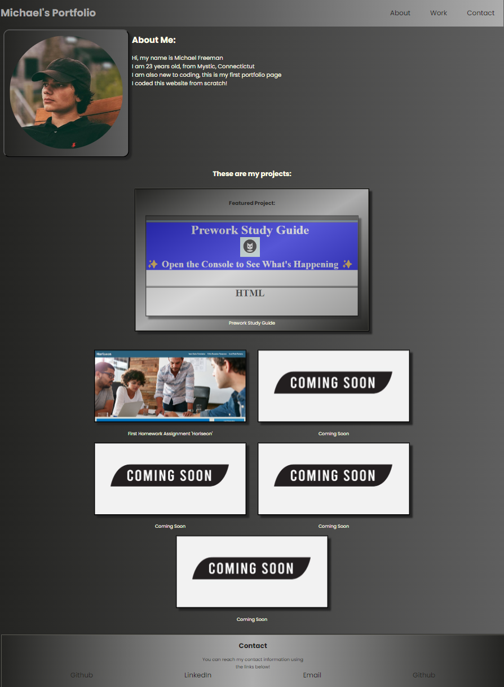

# portfolio-hw2

## Description
In this project we were tasked to create a portfolio page that includes many features. Some include, having a working nav bar that directs links to sections on the page that correspond to that link. Another was having our first work shown bigger than the rest of them. I also included a contact me section which has a few links to get in contact with me.

## Screenshot

## Site Link 
https://mikef13x.github.io/portfolio-hw2/

